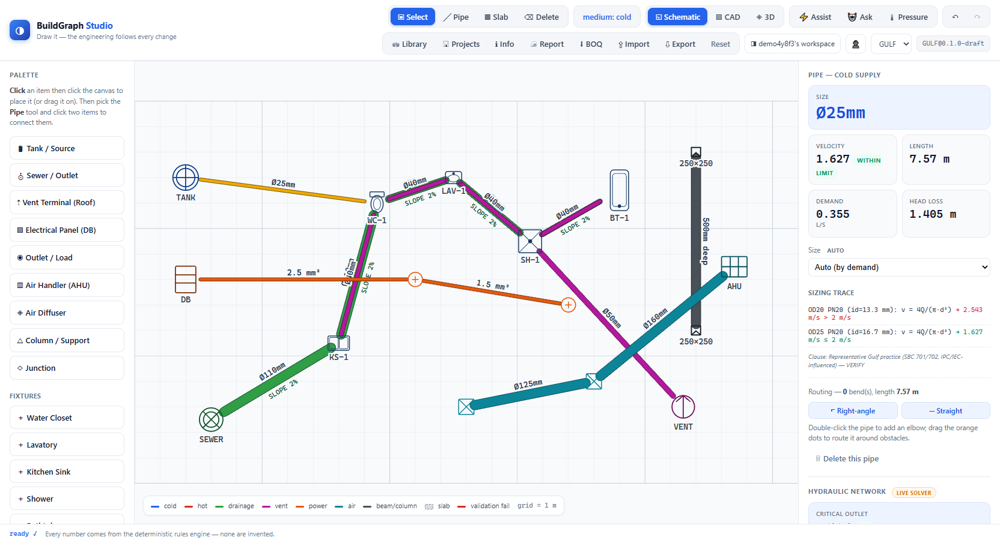
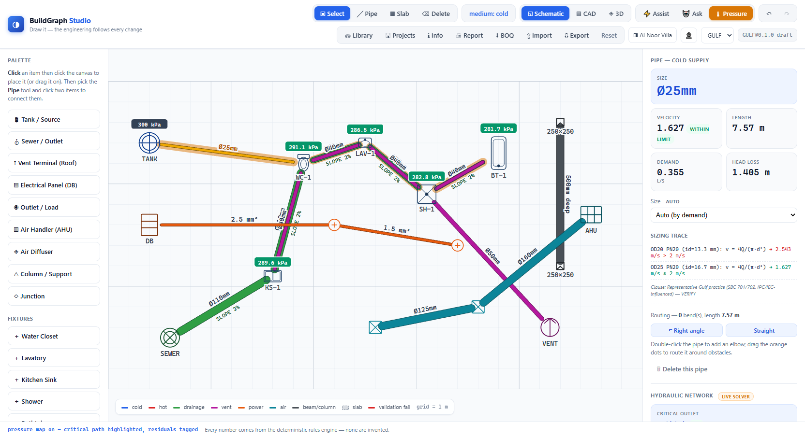
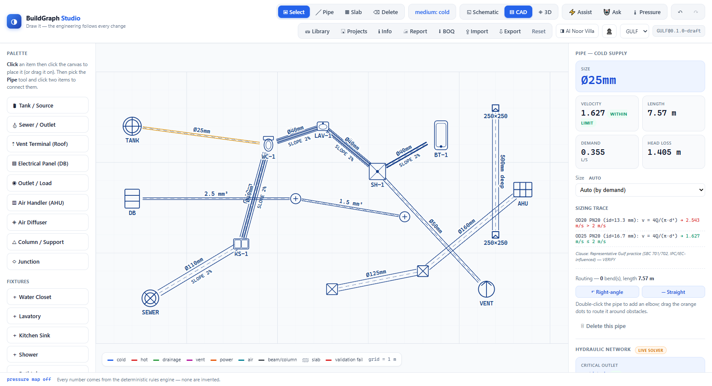
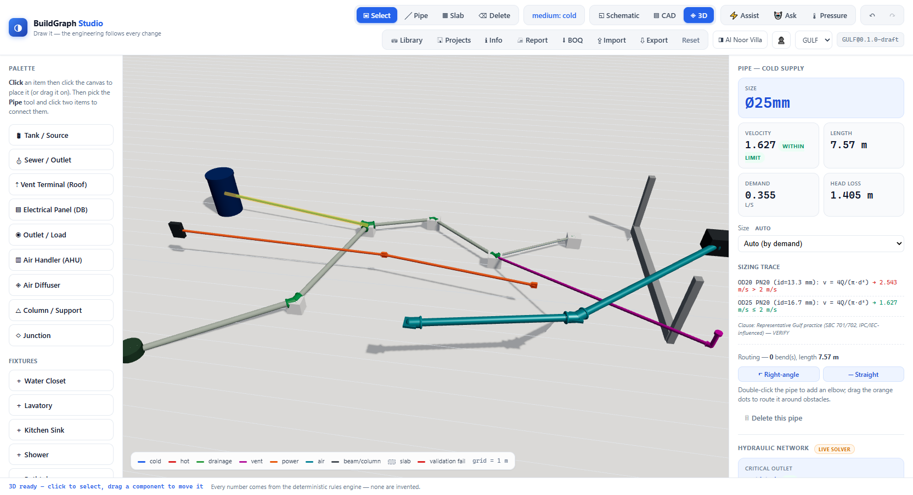
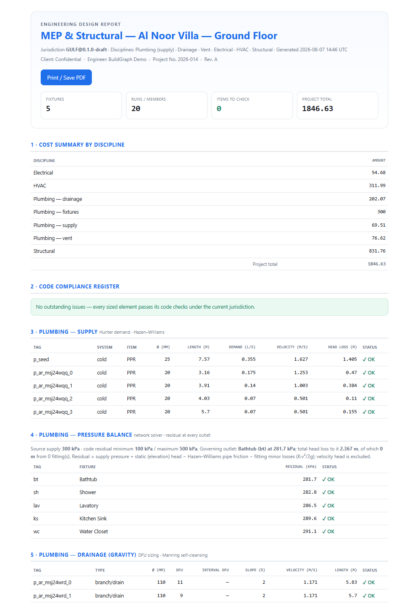
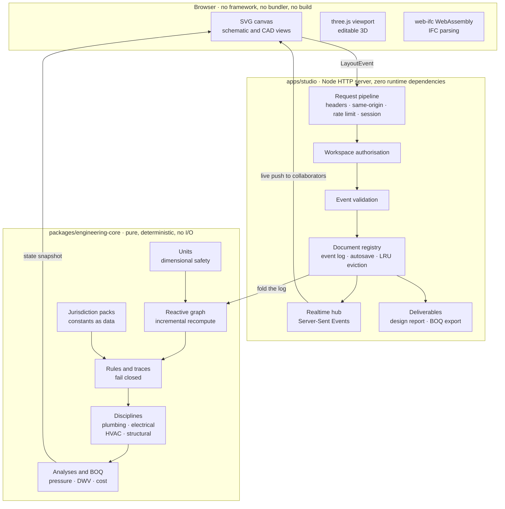
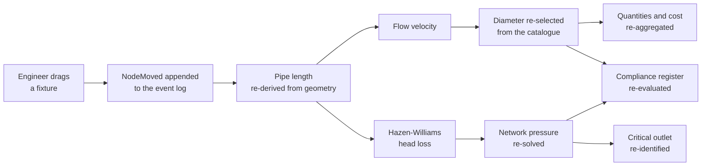

<div align="center">

# BuildGraph

**An engineering intelligence platform for building services.**

Draw a building's systems and the engineering follows every change — sizes, code checks,
pressure balance, structural design and a priced bill of quantities, recomputed live, with
the working shown for every number.

[](https://github.com/muhamadbyaba/Graph-Studio/actions/workflows/ci.yml)
[](LICENSE)
[](https://nodejs.org)
[](packages/engineering-core/tsconfig.json)
[](#why-zero-dependencies)
[](#testing)



</div>

---

## Contents

- [The problem](#the-problem)
- [What it does](#what-it-does)
- [What it looks like](#what-it-looks-like)
- [Architecture](#architecture)
- [How one edit propagates](#how-one-edit-propagates)
- [Repository structure](#repository-structure)
- [Built with](#built-with)
- [Codebase at a glance](#codebase-at-a-glance)
- [Getting started](#getting-started)
- [Security](#security)
- [Deploying](#deploying)
- [Testing](#testing)
- [Status and roadmap](#status-and-roadmap)
- [Contributing](#contributing)
- [Licence](#licence)

---

## The problem

Drawing tools draw. They do not know that moving a fixture three metres changes the demand on
the pipe feeding it, that the pipe is now undersized, that the residual pressure at the furthest
outlet has dropped below the code minimum, and that the bill of quantities is out of date.

So an MEP engineer draws in one tool, sizes in a spreadsheet, checks against a code PDF, and
takes off quantities by hand. The three artefacts disagree the moment anything moves, and the
reconciliation is manual, repeated on every revision, and where the errors live.

BuildGraph closes that loop. The drawing *is* the model. Every edit propagates through a
deterministic rules engine, and the sizes, the compliance register and the priced take-off are
all views of the same live state.

## What it does

**Four disciplines on one canvas.** Plumbing (cold, hot, drainage, vent), electrical, HVAC and
reinforced concrete — seven media in total, each a tree rooted at its own source: tank, sewer
outlet, roof vent terminal, distribution board, air handling unit.

**Everything sizes itself, and shows its work.** Hunter demand and Hazen–Williams for supply;
DFU tables and Manning self-cleansing velocity for drainage; ampacity plus voltage drop for
cables; the velocity method for ducts; ACI-style flexure and axial design for beams, columns and
slabs. Select any element and the inspector shows the formula, the inputs, each step, the sizes
that were rejected and why, and the clause it answers to.

**A hydraulic network solver, not per-pipe sizing.** Most tools size each pipe in isolation.
BuildGraph solves the whole supply tree: residual pressure at every outlet, the critical path
that governs it, Hazen–Williams friction plus fitting minor losses by the K-factor method — where
a tee takes branch or run K depending on the actual turn angle in your drawing. When it fails, it
computes the fix: the exact supply pressure that clears it, or the specific pipes to upsize,
applied as ordinary edits you can undo.

**Code as data, not code.** Every jurisdiction-dependent constant lives in a swappable pack.
Switch from Gulf practice to US and the same event log re-folds under different constants: a 20 m
circuit that needed 1.5 mm² at 230 V comes back as 2.5 mm² at 120 V, from the same drawing, with
no migration. Adding a jurisdiction is a data file, not a fork.

**Deliverables an engineer can hand over.** A submittal-quality design report — cover, cost
summary by discipline, code compliance register, per-discipline schedules, structural design,
fixture schedule, priced bill of quantities, and an explicit Engineer-of-Record disclaimer. Plus
the bill of quantities as a contractor-ready CSV.

**A design copilot that cannot make numbers up.** Ask "what fails?", "why this size?", "what does
this cost?" in plain language. The model is given read-only tools over the engine and a prompt
that forbids inventing figures — so every quantity it states was computed by the rules engine, not
generated. With no API key configured it still answers, deterministically, from the same engine.

**Live collaboration.** Workspaces with an owner and invited members; edits stream to every
collaborator over Server-Sent Events as they happen.

**Import what exists.** Drop an IFC model and it is section-cut at a chosen height into a real 2D
floor plan you can trace your services over — a horizontal slice through the geometry, not a
projection.

## What it looks like

<table>
<tr>
<td width="50%"></td>
<td width="50%"></td>
</tr>
<tr>
<td><b>Pressure map.</b> The governing path lights up and every outlet carries its residual pressure. Drop the supply and watch which fixture fails first.</td>
<td><b>CAD sheet.</b> The same model as double-line monochrome pipework — the drawing an engineer would actually issue.</td>
</tr>
<tr>
<td></td>
<td></td>
</tr>
<tr>
<td><b>3D model.</b> Editable, not just a preview — click to select, drag to move, and the plan follows.</td>
<td><b>Design report.</b> Generated from the model: compliance register, per-discipline schedules, priced bill of quantities, Engineer-of-Record disclaimer.</td>
</tr>
</table>

## Architecture

Three layers with a one-way dependency: the browser talks to the server, the server reads the
engine, and the engine knows nothing about either. No engineering is computed above the core.



**Why the arrow only points one way.** The engine is a library of pure functions over plain data.
It has no database, no request context and no notion of a user, which is what makes it testable
against hand calculations and reusable outside this application entirely.

### Why zero dependencies

The engine and the server import nothing but the Node standard library. No framework, no ORM, no
bundler, no build step. That is a deliberate constraint, and it buys three things:

- **Auditability.** An engineer or a security reviewer can read the whole path from HTTP request
  to sized pipe without leaving this repository.
- **Longevity.** Engineering software outlives web framework fashions. There is nothing here to
  migrate off in three years.
- **Supply chain.** Zero runtime dependencies is zero runtime supply-chain surface. The two
  browser libraries (three.js, web-ifc) are served from this origin under a strict CSP.

The trade-off is real: some things a framework gives you for free are written here by hand. Where
that cost outweighs the benefit — the WebAssembly IFC parser, the 3D renderer — a library is used.

## How one edit propagates

This is the whole thesis in one diagram. Dragging a fixture appends a single event; everything
downstream of it recomputes, and nothing else does.



The propagation graph tracks dependencies automatically as values compute, so a change marks only
its dependents stale and reading recomputes only what is actually observed. A diamond dependency
recomputes once. Cells on an untouched branch never recompute at all. It is spreadsheet
recalculation applied to engineering objects, in about 100 lines.

Four ideas carry the design:

| Idea | What it buys |
| --- | --- |
| **Dimensionally safe quantities** | Adding metres to litres per second throws instead of producing a plausible wrong number. Millimetres and metres round-trip losslessly. |
| **Reactive propagation** | The design is live. Nothing is ever stale, and nothing recomputes without cause. |
| **Pure rules with traces** | `(inputs, jurisdiction) → { value, pass, trace }`. The trace is the deliverable, not logging. When nothing in the catalogue fits, the rule returns `null` with an explanation rather than guessing. |
| **Event sourcing** | Undo, redo, audit, deterministic replay and jurisdiction switching all fall out of the model being a fold of its log. An old project picks up today's engine when you reopen it. |

## Repository structure

```
Graph-Studio/
│
├── packages/engineering-core/        the rules engine — pure, deterministic, no I/O
│   ├── src/
│   │   ├── units/                    dimensionally safe Quantity (mm, m, L/s, A, V, kN)
│   │   ├── core/                     reactive propagation graph — auto-tracked dependencies
│   │   ├── rules/                    the Rule contract and registry
│   │   ├── jurisdiction/             code packs: GULF, US — constants as swappable data
│   │   ├── plumbing/                 hydraulics · demand · drainage · vent · pressure · recirculation
│   │   ├── electrical/               ampacity · voltage drop · cable sizing
│   │   ├── hvac/                     velocity-method duct sizing
│   │   ├── structural/               RC beams · tied columns · deflection-governed slabs
│   │   ├── model/                    geometric layout, topology, spanning-tree auto-routing
│   │   ├── events/                   event sourcing — transactional, memoised history
│   │   ├── boq/                      quantity aggregation and costing
│   │   ├── catalog/                  cross-discipline component library (132 items)
│   │   ├── geometry/                 horizontal section cut — mesh to 2D wall segments
│   │   └── ai/                       tool bus and the numeric guardrail
│   ├── test/                         174 tests, including golden hand calculations
│   └── examples/                     runnable scripts demonstrating the engine standalone
│
├── apps/studio/                      the application over the engine
│   ├── server.ts                     entry point — services, HTTP, graceful shutdown
│   ├── src/
│   │   ├── config.ts                 environment parsing; unsafe defaults refuse to start
│   │   ├── app.ts                    request pipeline and route table
│   │   ├── auth/                     scrypt passwords · sessions · accounts and workspaces
│   │   ├── http/                     errors · responses · CSP · rate limiting · static files
│   │   ├── model/                    event validation · documents · serialisation
│   │   ├── report/                   design report (HTML) and BOQ export (CSV)
│   │   ├── routes/                   auth · workspaces · design · library · exports
│   │   ├── realtime/                 Server-Sent Events fan-out
│   │   ├── storage/                  atomic JSON persistence · projects · catalogue
│   │   └── copilot/                  grounded assistant with read-only engine tools
│   ├── public/                       the browser client — vanilla JS, no framework
│   │   ├── index.html                app shell and import map
│   │   ├── app.js                    canvas, tools, inspector, panels, collaboration
│   │   ├── three-view.js             editable 3D scene
│   │   ├── styles.css                design system
│   │   └── ifc.js                    IFC parsing and section-cut in the browser
│   ├── scripts/vendor.mjs            copies browser assets out of node_modules on install
│   └── test/                         71 tests against a real running server
│
├── docs/                             design documents, deployment guide, module contract
├── .github/                          CI workflows, issue forms, PR template, Dependabot
├── Dockerfile, compose.yaml          container image and single-node deployment
└── SECURITY.md, CONTRIBUTING.md      the security model and what a change must satisfy
```

## Built with

Everything in the repository, including the parts GitHub's language bar does not surface — it
counts only programming and markup files, so the data, prose and configuration formats below are
invisible to it despite being load-bearing.

### Languages the source is written in

| Language | Where it is used | Why this and not something else |
| --- | --- | --- |
| **TypeScript** | The engine and the entire server. 106 files, ~10,900 lines, `strict` throughout. | The domain is full of unit errors waiting to happen. Types catch a metre passed where a millimetre was meant, before the code runs. `erasableSyntaxOnly` is enabled so the source can never drift into syntax that would require a compiler. |
| **JavaScript** | The browser client — canvas, 3D view, IFC handling. 4 files, ~2,100 lines, ES modules. | Deliberately un-typed and un-built. The browser loads these directly, so there is no bundler, no transpile step and no source maps to go stale. The drawing logic is DOM and geometry work that a framework would not have simplified. |
| **CSS** | The design system: tokens, layout, canvas rendering rules, print styles. 1 file, ~380 lines. | Hand-written custom properties. No preprocessor, no utility framework, no build. |
| **HTML** | The application shell and its import map. 1 file, ~290 lines. | Static. The import map is what lets the browser resolve bare module specifiers with no bundler; its hash is pinned in the Content-Security-Policy. |
| **SVG** | Generated at runtime — plan symbols, pipework, slabs, dimension labels, the fixture library. | The 2D canvas is SVG rather than `<canvas>`, so every element is a real DOM node: hit-testable, styleable by CSS, and inspectable in devtools. |

### Data, configuration and infrastructure formats

| Format | Where it is used |
| --- | --- |
| **JSON** | Package manifests, TypeScript configuration, and the persistence layer itself — accounts, sessions, event logs and saved projects are atomic JSON files rather than a database. |
| **YAML** | GitHub Actions workflows, Dependabot policy, the four issue forms, and `compose.yaml`. 7 files. |
| **Markdown** | 19 documents, ~3,260 lines: the README, security model, contributor guide, deployment guide, changelog and the nine design documents. |
| **Dockerfile** | The container image. No build stage, because there is nothing to build. |
| **Bash** | The CI smoke-test steps that boot the server and exercise it end to end. |
| **dotenv** | `.env.example` documents every setting; Node loads it natively with `--env-file`. |
| **INI** | The systemd unit in the deployment guide. |
| **nginx configuration** | The reverse-proxy example, including the buffering setting that Server-Sent Events actually require. |
| **EditorConfig, gitattributes, gitignore** | Cross-editor formatting and line-ending normalisation, so the repository is byte-identical on Windows, macOS and Linux. |

### Formats the system reads and writes

| Format | Direction | Notes |
| --- | --- | --- |
| **IFC** (ISO 10303-21 / STEP) | Import | Parsed in the browser by web-ifc, then section-cut server-side into a traceable 2D floor plan. |
| **WebAssembly** | Consumed | The IFC parser. `'wasm-unsafe-eval'` is the only relaxation in an otherwise strict script policy. |
| **CSV** (RFC 4180) | Export | The bill of quantities, with spreadsheet formula injection defused. |
| **HTML** | Export | The generated design report, served under its own Content-Security-Policy. |
| **JSON** | Import and export | Whole projects, as their event log — which is why a reopened project replays through today's engine. |
| **PNG, JPEG, PDF** | Import | Raster underlays to trace over. |

### Runtime and tooling

| | |
| --- | --- |
| **Node.js ≥ 23.6** | Runs the TypeScript directly through native type stripping. No build step anywhere in the project. |
| **Node test runner** | The entire suite. No Jest, no Vitest, no assertion library. |
| **three.js** | The 3D viewport. One of only two runtime libraries, and it is browser-side only. |
| **web-ifc** | IFC parsing, as WebAssembly. The other browser-side library. |
| **GitHub Actions** | Typecheck and tests on Linux, Windows and macOS, plus a job that boots the server and exercises the API end to end. |
| **Docker** | Single-node deployment: unprivileged user, read-only root filesystem, health check. |

**Server runtime dependencies: zero.** Both libraries above are loaded by the browser and served
from this origin.

## Codebase at a glance

| | Files | Lines |
| --- | ---: | ---: |
| Engine source | 42 | 3,974 |
| Engine tests | 32 | 2,053 |
| Server source | 27 | 3,759 |
| Server tests | 5 | 1,081 |
| Browser client (JavaScript) | 4 | 2,099 |
| Browser shell (HTML, CSS) | 2 | 667 |
| Documentation | 19 | 3,263 |
| CI, container and configuration | 19 | 693 |

Roughly one line of test for every three lines of source, and every engineering result is checked
against a hand calculation rather than a snapshot.

## Getting started

```bash
git clone https://github.com/muhamadbyaba/Graph-Studio.git
cd Graph-Studio
npm install
npm start
```

Then open <http://127.0.0.1:4317> and create an account.

To skip the sign-in while you look around:

```bash
BG_AUTH_MODE=open npm start
```

That mode refuses to start on anything but loopback, so it cannot be exposed by accident.

**Requires Node 23.6 or newer.** There is no build step — Node runs the TypeScript directly.

### A two-minute tour

1. Click **Tank / Source** in the palette, then click the canvas. Do the same for a couple of
   fixtures.
2. Press **P**, click two components to connect them. Sizes, velocities and head losses appear
   immediately; the bill of quantities prices itself on the right.
3. Drag a fixture. Watch the pipe length, the head loss, the pressure balance and the cost all
   follow.
4. Hit **🌡 Pressure**. The critical path lights up and every outlet is tagged with its residual.
   Drop the supply pressure in the panel until something turns red, then use the auto-fix.
5. Switch the jurisdiction dropdown from `GULF` to `US` and watch the design re-validate.
6. Hit **🖨 Report** for the full design document.

## Security

Designed to be hosted, not just run locally. [`SECURITY.md`](SECURITY.md) documents the model in
full, including what is deliberately **not** implemented. Every request passes the same pipeline,
so a new route cannot forget a check:

```mermaid
flowchart LR
    R["Request"] --> H["Security headers<br/>CSP · nosniff · frame-deny"]
    H --> O["Same-origin check<br/>on state-changing methods"]
    O --> L["Rate limit"]
    L --> S["Session lookup<br/>hashed token"]
    S --> W["Workspace<br/>authorisation"]
    W --> V["Payload validation<br/>shape · type · range"]
    V --> X["Handler"]
    X --> T["Transactional apply<br/>rollback on failure"]
    T --> E["Output encoding<br/>HTML and CSV"]
    E --> P["Response"]
```



- **Accounts** with scrypt-hashed passwords, constant-time verification, and identical cost and
  response for an unknown username as for a wrong password.
- **Sessions** carried in an opaque random token; only its SHA-256 is stored, so the session file
  is not a credential. `HttpOnly`, `SameSite=Strict`, `Secure` behind TLS.
- **Authorisation** on every request. Workspaces have an owner and an explicit member list; a
  workspace id in a header or query string is a claim, never a grant. Unknown and unauthorised
  both return `404` so ids cannot be probed.
- **Input validated at the boundary** into known event shapes with in-range values, then checked
  for referential integrity by the model, with any failure rolled back.
- **Output encoded at every sink** — HTML escaping in the report and the UI, formula-injection
  defusing in the CSV export.
- **A strict CSP** with no `unsafe-inline` for scripts; the two legitimate inline scripts are
  allowed by the hash of their exact contents, computed from the served file at start-up.
- **Resource limits** on body size, events, resident documents and live connections, plus rate
  limits on sign-in, registration and the expensive endpoints.

These properties are tested, not asserted:
[`apps/studio/test/security.test.ts`](apps/studio/test/security.test.ts) runs a real server and
checks each one.

## Deploying

```bash
export BG_SESSION_SECRET=$(node -e "console.log(require('crypto').randomBytes(32).toString('hex'))")
export NODE_ENV=production
export BG_BEHIND_TLS_PROXY=true   # TLS terminated by your proxy
export BG_ALLOW_REGISTRATION=true # create your accounts, then set this back to false
npm start
```

Or with the provided container:

```bash
BG_SESSION_SECRET=... docker compose up -d
```

Put a TLS-terminating reverse proxy in front. Back up `BG_DATA_DIR` — it holds accounts, live
documents and saved projects. [`.env.example`](.env.example) documents every setting, and
[`docs/DEPLOYMENT.md`](docs/DEPLOYMENT.md) covers proxies, systemd, backups and the scaling
ceiling.

## Testing

```bash
npm run check     # typecheck + every test
npm test          # 245 tests across both workspaces
```

Three kinds of test, deliberately:

**Golden calculations.** Specific numbers checked against hand calculations, with the working in a
comment — 1 L/s through 100 m of 50 mm at C = 150 losing 0.606 m; a tee losing exactly three times
more through the branch (K = 1.8) than through the run (K = 0.6); `Pu = 4300 kN` sizing to a
450 mm column under Gulf constants and 500 mm under US. These are what stop a refactor from
quietly changing an engineering answer.

**Property and integration tests.** That the propagation graph is genuinely incremental; that a
diamond dependency recomputes once; that a rejected edit leaves the document readable; that the
same event log under two jurisdiction packs produces two correct, different designs.

**Security tests.** A real server on an ephemeral port, checking each claim in `SECURITY.md`:
anonymous access refused, cross-workspace access invisible, traversal contained, forgery rejected,
injection neutralised.

## Status and roadmap

Working today: four disciplines and seven media; two jurisdictions; the hydraulic network solver
with minor losses, auto-fix and hot-water recirculation balancing; drainage and vent connectivity
validation with stack-versus-branch sizing; beams, columns with multi-storey load accumulation,
and slabs; IFC section-cut import; live multi-user collaboration; the design report and BOQ
export; the grounded copilot.

Known limits, stated plainly because engineering software should not overclaim:

- Elevation is a per-node property; the plan is 2D and 3D infers routing from it. True 3D routing
  with clash detection is not implemented.
- Structural design is preliminary: short columns without slenderness or P-M interaction,
  deflection-governed slabs on rectangular panels without openings.
- Collaboration is state broadcast over a shared log — last-write-wins, not operational transforms
  or a CRDT.
- DWG import is not implemented. IFC import produces a traceable 2D plan and a 3D reference.
- Single process: sessions, live documents and rate limiters are in memory, so horizontal scaling
  needs a shared store first.
- Unit rates and several code constants are representative and carry `VERIFY` markers until
  someone checks them against a published source.

Next: verifying constants against adopted codes jurisdiction by jurisdiction, deeper structural
analysis, more jurisdictions, and DWG import. See the issues and
[`docs/05-development-roadmap.md`](docs/05-development-roadmap.md).

## Contributing

Contributions are welcome, and [`CONTRIBUTING.md`](CONTRIBUTING.md) explains what the codebase
expects. The short version: engineering numbers come only from the engine, every result carries
its trace, code constants live in jurisdiction packs, rules fail closed, and anything numeric
needs a golden test.

If you are an engineer rather than a programmer, the most valuable contribution is verifying a
constant against the code you actually work to — there is an issue template for exactly that.

## Licence

Apache License 2.0. See [LICENSE](LICENSE) and [NOTICE](NOTICE).

Permissive, with an explicit patent grant, so it can be used commercially and built on freely. If
you need different terms for a commercial product, open a discussion.

---

**Decision-support software.** Every size, quantity and rate it produces is preliminary and
requires review, analysis and sign-off by a qualified Engineer of Record. Jurisdiction constants
shipped here are representative values pending verification against the code adopted for your
project. This tool exists to make an engineer faster and their reasoning auditable — not to
replace their judgement or their liability.
